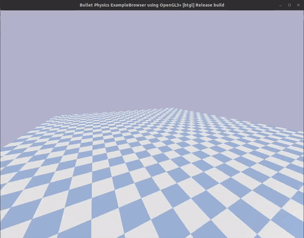
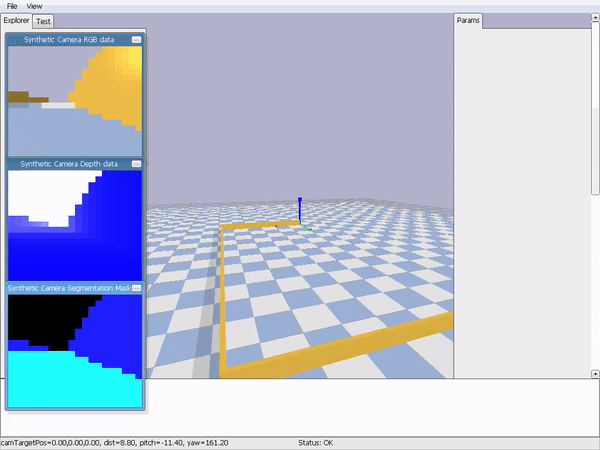

# Crazy Car with Reinforcement Learning

This is my thesis. You can get more detail [here](https://docs.google.com/presentation/d/1HilDUzPlwFacKIIccm89qESuJkIsprO7LFcIjbHmzj4/edit?usp=sharing). 

## Setup Environment

```shell
$ pip install -r requirements.txt
```

## Running the code

**training a model.**

```shell
$ python -m crazycar.scripts.training --name NAME
```

Where `NAME` is a name of the experiment. You can see more about flags with `--help`

**testing a model.**

Incoming...

## Demo

* Sensor




* Camera



